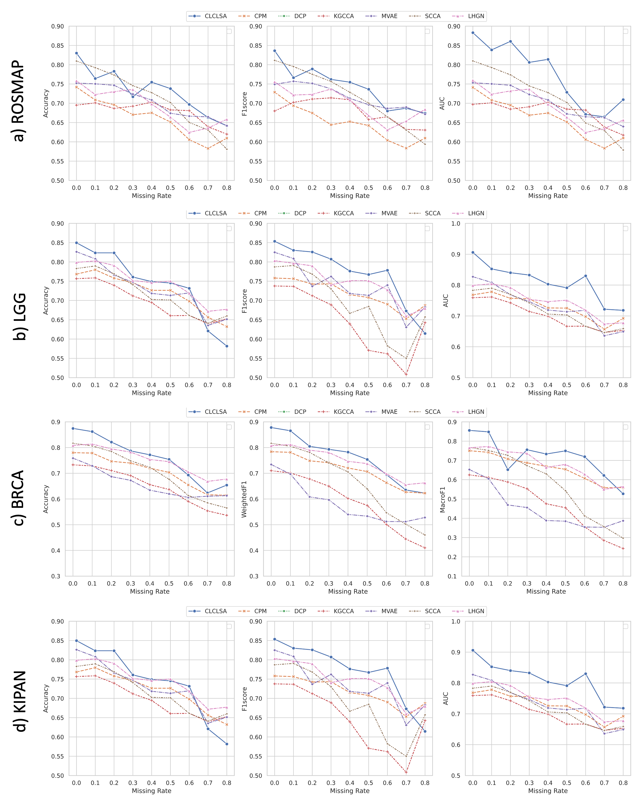

## CLCLSA: Cross-omics Linked embedding with Contrastive Learning and Self Attention for multi-omics data classification with missing views

### Chen Zhao, Anqi Liu, Xiao Zhang, Xuewei Cao, Zhengming Ding, Qiuying Sha, Hui Shen, Hong-Wen Deng*, Weihua Zhou* (whzhou@mtu.edu)

### Abstract
Integration of heterogeneous and high-dimensional multi-omics data is becoming increasingly important in understanding genetic data. However, one obstacle faced when performing multi-omics data integration is the existence of unpaired multi-omics data due to instrument sensitivity and cost. And studies may fail if certain aspects of the subjects are missing or incomplete. In this paper, we propose a deep learning method for multi-omics integration with incomplete data by Cross-omics Linked unified embedding with Contrastive Learning and Self Attention (CLCLSA). Utilizing complete multi-omics data as supervision, the model uses cross-omics autoencoders to learn the feature representation across different types of biological data. The multi-view contrastive learning, which is used to maximize the mutual information between different types of omics, is employed before latent feature concatenation. Also, the feature-level self-attention and omics-level self-attention are employed to dynamically select the most informative features for multi-omics data integration. Extensive experiments were conducted on four public multi-omics datasets. The experimental results indicated that the proposed CLCLSA outperformed the state-of-the-art approaches for multi-omics data classification using incomplete multi-omics data.

### Model architecture

### Classification performance comparisons with different missing rates on a) ROSMAP, b) LGG, c) BRCA and d) KIPAN datasets

### Code usage

`main_clcl.py`
- `data_folder`: path for data folder
- `missing_rate`: missing rate of omics data
- `hidden_dim`: size of hidden layer 
- `prediction`: tuple for hidden layer size of cross-omics autoencoders
- `lambda_cl`: contrastive learning balancing factors
- `lambda_co`: cross omics prediction loss factor
- `lambda_al`: auxilary classification loss

### Running example
`python main_clcl.py --data_folder=LGG --missing_rate=0.2 --hidden_dim=200 --device=cuda`

### environments
- matplotlib==3.4.0
- numpy==1.20.3
- pandas==1.5.3
- torch==1.10.0
- tqdm==4.64.1
